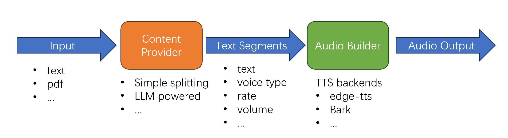

Automatically generate podcast from text, pdf, etc..



## Setup

``` bash
pip install -r requirements.txt
```

OpenAI API

(bash)

``` bash
export OPENAI_API_BASE=https://xxxx/v1
export OPENAI_API_KEY=skxxxxxxxxxxxxxxxx
```

(windows cmd)

```
set OPENAI_API_BASE=https://xxxx/v1
set OPENAI_API_KEY=xxxxxxxxxxxxx
```

## TODO list

### Content Providers

- [x] plain text file
- [x] plain PDF to text
- [x] LLM fixing line breaks in PDF
- [ ] LLM assigning different voices to characters
- [ ] Automatic translation
- [ ] LLM generated contents

### TTS Backends

- [x] [edge-tts](https://github.com/rany2/edge-tts)
- [ ] [Bark](https://github.com/suno-ai/bark)

### LLM Backends

- [x] ChatGPT 3.5
- [ ] Open source LLMs

### TODO


不同角色不同声音
- 维护一个之前页人物-声音queue，每次作为chatgpt输入，过长截断

chain结构，插入可选的task，比如用中文解释难词
- 解释频率问题：每一段or每一章
- UI上标出来，用词典解释

效率提升
- temp 二进制存数据库
- 章节索引
- 每句话的text、开始结束时间存数据库

Fancy UI 交互
后端
